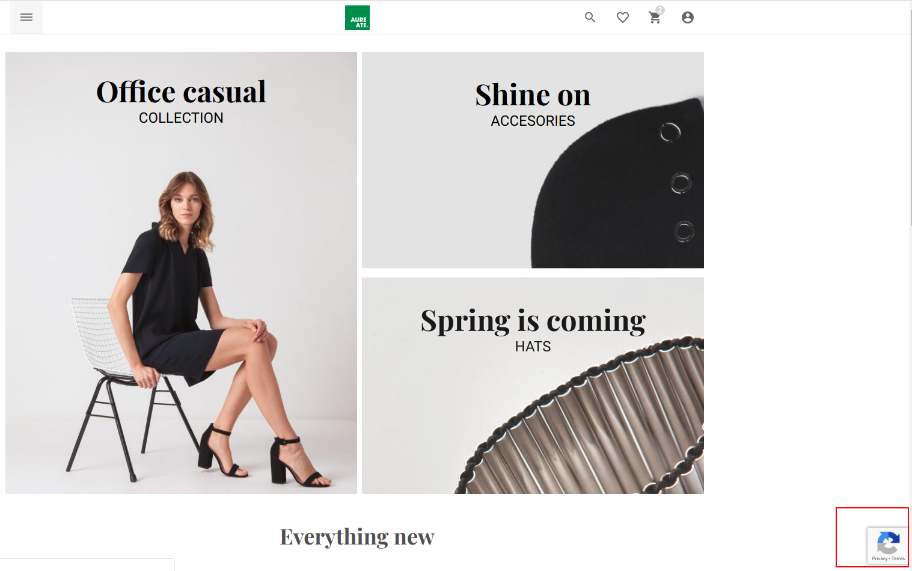

# Vue Storefront Google Invisible reCAPTCHA extension
[Google Invisible reCAPTCHA v3](https://developers.google.com/recaptcha) integration for [vue-storefront](https://github.com/aureatelabs/vsf-google-recaptcha), by [Aureate Labs](https://aureatelabs.com/)
> This extension helps to prevent bot form submission using Google reCAPTCHA service

**Note:** Google reCAPTCHA registration required (It's a free) to use this extension into your vue-storefront website.

Google reCAPTCHA is for the protect the spamming your any submiting form and idea about to do some other stuff authentication to prevent this.



Google reCAPTCHA documentation: https://developers.google.com/recaptcha/intro

## Installation:

### 1. Clone the repository

Clone the vsf-google-recaptcha repository into your VSF installation.
```shell
$ git clone git@github.com:aureatelabs/vsf-google-recaptcha.git vue-storefront/src/modules/google-recaptcha
```
### 2. Add the extension config to your local VSF configuration file.
Add the following JSON config snippet into your desired config, eg. `config/local.json`
```json
"googleRecaptcha" : {
   "tokens" : {
       "site_key": "<YOUR_CAPTCHA_SITE_KEY>",
       "secret_key": "<YOUR_CAPTCHA_SECRET_KEY>"
   },
   "endpoint": "/api/ext/google-recaptcha/is-verify",
   "is_active": false
}
```
Replace the `site_key` & `secret_key` parameter with the site key & secret key provided by Google reCAPTCHA registration time. You can find your Captcha Site Key here: https://www.google.com/recaptcha/admin/. Setting `is_active` to `false` will disable the google reCAPTCHA extension at runtime.

Valid site_key example: `"site_key": "6Lcn_Z0UAAAAAN4LdRSfM5eNd3LJ-xPfUtnV6Lud"`
Valid secret_key example: `"secret_key": "6Lcn_Z0UAAAAACodWP8oU9wcdVKatvQVBqklWA9c"`
### 3. Register the Google reCAPTCHA extension
Open up your `../vue-storefront/src/modules/index.ts` and add the following code. Adding it inside this file the registers the extension so it can be used in your Vue Storefront.
```js
import { GoogleRecaptcha } from './google-recaptcha'
...
export const registerModules: VueStorefrontModule[] = [
...
GoogleRecaptcha
...
]
```
### 4. How to call captcha method
In your theme template file you can directly call store action and immediate next you can check captcha is verified or not
```js
this.$store.dispatch('googleRecaptcha/isVerifiedCaptcha')
if (!this.$store.state.googleRecaptcha.is_verified) {
    //captcha is not verified
}
```

### 5. Now, Clone google reCAPTCHA API extension to your local vue-storefront-api
Copy extension to your /path/to/vue-storefront-api/src/api/extensions/
```shell
$ cp -f ./API/google-recaptcha /path/to/vue-storefront-api/src/api/extensions/
```

### 6. Add the extension config to your local VSF API's configuration file
Add the following JSON config snippet into your desired config, eg. `config/local.json`
```json
"googleRecaptcha" : {
  "tokens" : {
      "secret_key": "<YOUR_CAPTCHA_SECRET_KEY>"
  },
  "score_match": {
    "enable": false,
    "low_score": 0.9
  }
}
```
Replace the `secret_key` parameter with the secret key provided by Google reCAPTCHA registration time. You can find your Captcha Site Key here: https://www.google.com/recaptcha/admin/. Setting `enable` to `true` will check the captcha base on the score response from the google captcha api. To disable score match simple set value to `false`. Possible values for `low_score` is `0.0` to `0.9`.

Valid secret_key example: `"secret_key": "6Lcn_Z0UAAAAACodWP8oU9wcdVKatvQVBqklWA9c"`

Sample response of api call `/api/ext/google-recaptcha/is-verify`
```
{ success: false, error: 'Invalid captcha found.' }
```

### 7. Enjoy!
Thats it! It's easy, plug and play! If you haven't got an Register captcha already, you can create one here, there is free tier that you can use to get started: https://www.google.com/recaptcha/admin/create

## Customization

### Replacing the Google captcha Script.
If you need to change the Intercom script that is loaded on the page, open up the `./google-recaptcha/hooks/afterRegistration.ts` file. On line 35 you'll find the script provided from Google reCAPTCHA, you can swap this out or extend it as required.

## License
This project is licensed under the [MIT License](https://github.com/aureatelabs/vsf-google-recaptcha/blob/master/LICENSE)
